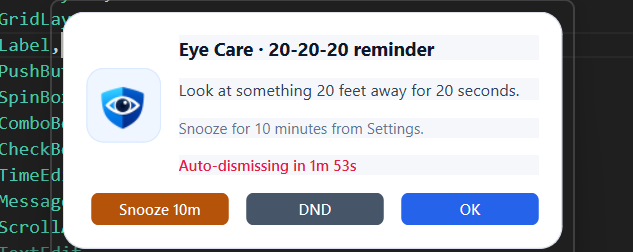
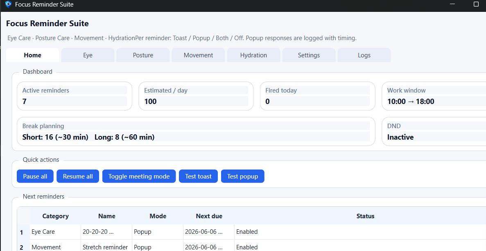
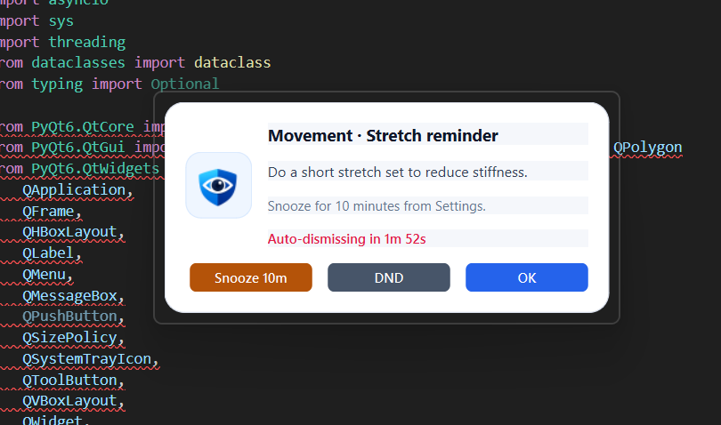
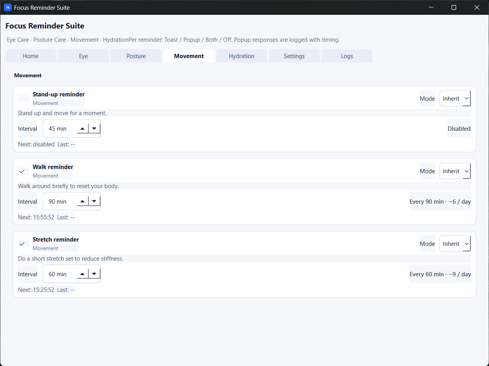
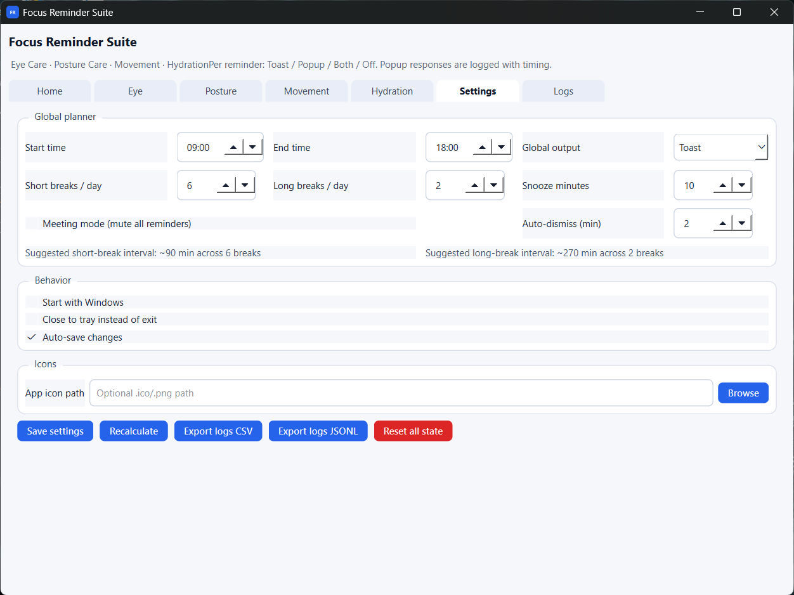

# Focus Reminder Suite

Focus Reminder Suite is a desktop utility application developed in Python and PyQt6 designed to help reduce fatigue, eye strain, and poor posture during long working sessions. The application schedules and displays interactive reminders for eye care, posture adjustment, physical movement, and hydration, with persistent logging to track user responses and habits over time.

---

## Screenshots

### 1. Sample Reminder


### 2. Home Dashboard


### 3. Custom Interactive Popup Dialog


### 4. Global Settings and Planner Configurations


### 5. Activity Logs Database View


---

## Features

- **Smart Reminder Scheduling**:
  - **Fixed Reminders**: Trigger at fixed periodic intervals (e.g., the 20-20-20 rule for eye care every 20 minutes).
  - **Random Reminders**: Trigger randomly within a defined duration range to prevent alert fatigue (e.g., posture checks every 25 to 45 minutes).
  - **Goal-Based Reminders**: Automatically schedule and space reminders across the active work window to meet a daily target (e.g., 8 hydration alerts spaced throughout the day).

- **Flexible Notification Delivery**:
  - **Toast Notifications**: Standard Windows system tray toast alerts using `winotify`.
  - **Custom Modal Popups**: Borderless, prominent, stay-on-top interactive dialogs.
  - **Configuration Options**: Alerts can be set to Toast, Popup, Both, or disabled entirely per reminder type.

- **Snooze and Do Not Disturb (DND)**:
  - Custom snooze intervals configurable via the settings interface.
  - One-click DND toggle and dedicated "Meeting Mode" to mute all reminders.
  - Optional auto-dismiss timer for popup windows to prevent persistent screen obstruction.

- **Database-Driven Tracking**:
  - Settings, reminder states, and application configuration are persisted in a local SQLite database (`focus_reminder_suite.db`).
  - Runtime logs record user responses (e.g., click, snooze, DND, timeout) with microsecond response timing for habit analysis.

- **System Integration**:
  - Background execution via system tray integration, featuring a context menu with options to toggle DND, pause/resume reminders, restore the interface, or exit.
  - Optional Windows startup integration.

---

## Project Structure

```
05 Smart Reminder/
│
├── main.py                  # PyQt6 application logic and UI components
├── main.spec                # PyInstaller build specification
├── icon.ico                 # Application window and tray icon (ICO format)
├── icon.png                 # Application logo (PNG format)
│
├── focus_reminder_suite.db  # SQLite database for settings and logs (auto-generated)
├── .gitignore               # Version control exclusion file
└── README.md                # Project documentation
```

---

## Requirements and Installation

This application is designed for Windows systems and requires Python 3.10 or higher.

### 1. Install Dependencies
Install the required packages using pip:
```bash
pip install PyQt6 winotify
```
*Note: `winotify` is optional but required to enable native Windows toast notifications.*

### 2. Run the Application
Execute the primary script to start the application:
```bash
python main.py
```

---

## Building to a Standalone Executable

You can compile the application into a standalone Windows executable (.exe) using PyInstaller.

### 1. Install PyInstaller
```bash
pip install pyinstaller
```

### 2. Compile using the Spec File
Run PyInstaller with the provided build configuration:
```bash
pyinstaller main.spec
```

### 3. Output
The compiled executable will be located in the `dist` directory:
- `dist/main.exe`

---

## Configuration and Settings

- **Work Window**: Define your daily working hours (e.g., 09:00 to 18:00). All reminder schedules are calculated within this window.
- **Break Suggestions**: Suggestions for break distributions are automatically calculated based on the configured work window duration.
- **Custom Application Icon**: Configure a path to an alternative .ico or .png file to customize tray and popup elements.
- **Auto-Save**: Changes to reminders, intervals, and planner settings are committed to the SQLite database automatically.
